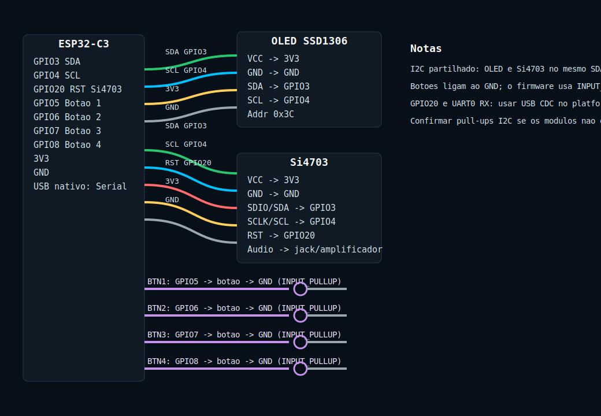
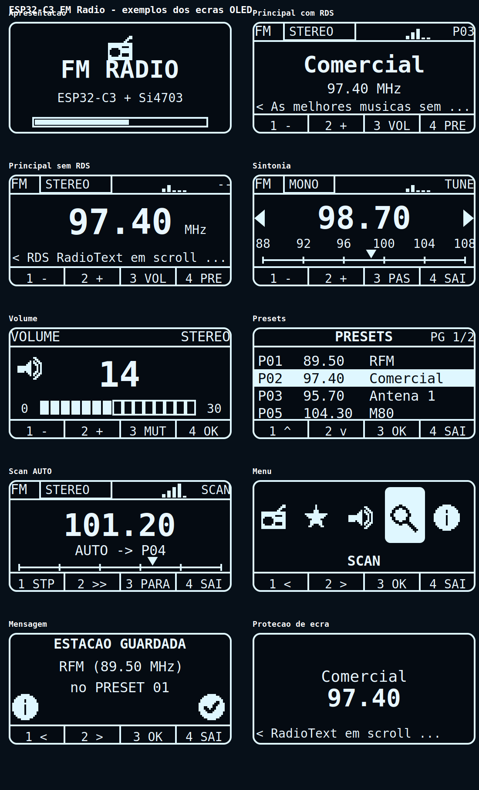

# ESP32-C3 FM Radio (Si4703 + OLED SSD1306)

[Português](README.md) | [English](README.en.md)

FM radio controlled by an **ESP32-C3**, with a **Si4703** module, **OLED SSD1306 128x64** display, and 4 physical buttons. Includes RDS (station name + RadioText), persistent presets, screen saver, and splash screen.

---

## Hardware

| Component | Connection | Notes |
|---|---|---|
| OLED SSD1306 | I2C `SDA=GPIO3`, `SCL=GPIO4`, addr `0x3C` | 128x64 |
| Si4703 | Shared I2C (`SDA=3`, `SCL=4`) + `RST=GPIO20` | RST active **HIGH** |
| Button 1 | `GPIO5` | active **LOW** (INPUT_PULLUP) |
| Button 2 | `GPIO6` | active **LOW** |
| Button 3 | `GPIO7` | active **LOW** |
| Button 4 | `GPIO8` | active **LOW** |

The I2C bus is initialized **only once** (by the radio, when enabled). Buttons connect to GND and use the internal pull-up.

### Wiring diagram



### Important: GPIO20 (RST) vs UART0

The Si4703 RST pin uses `GPIO20`, which is the ESP32-C3 **UART0 RX** by default. To avoid conflicts, `Serial` is routed to the **native USB** interface (USB Serial/JTAG) through build flags in [`platformio.ini`](platformio.ini):

```ini
build_flags =
  -DARDUINO_USB_MODE=1
  -DARDUINO_USB_CDC_ON_BOOT=1
```

This leaves UART0 (GPIO20/21) free for RST and makes the serial console appear over USB. **Without this, RST does not work and RSSI always reads invalid values.**

### Enabling the radio

In [`include/config.h`](include/config.h):

```cpp
constexpr bool RADIO_ENABLED = true;   // false while the Si4703 is not connected
```

With `false`, the Si4703 is not initialized. This is useful for testing only the UI/buttons without blocking the OLED I2C bus.

---

## Build and upload (PlatformIO)

```bash
pio run                                # build
pio run -t upload --upload-port COM4   # upload (adjust the port)
pio device monitor -b 115200           # serial console
```

Libraries (in [`platformio.ini`](platformio.ini)): Adafruit GFX, Adafruit SSD1306, Adafruit BusIO, mathertel/Radio. Presets use `Preferences` (NVS), already included in the ESP32 core.

---

## Startup

1. **Splash** screen for 5 seconds with a progress bar.
2. Loads presets and the last frequency/volume from NVS.
3. Enters the **Main** screen.

---

## Screens and buttons

Buttons **1-4** are physical; the display only shows each button function in the bottom bar. The pressed button cell is **inverted**.

### 1. Main (radio playback)

Shows the station name (RDS) or frequency, RSSI, stereo/mono, current preset, and scrolling RadioText (RDS).

| Button | Short press | Long press |
|---|---|---|
| 1 | Frequency - | **Open Menu** |
| 2 | Frequency + | - |
| 3 | Go to Volume | - |
| 4 | Go to Presets | - |

### 2. Tuning (TUNE)

| Button | Function |
|---|---|
| 1 | Frequency - (step) |
| 2 | Frequency + (step) |
| 3 | Toggle step (0.10 / 0.05 MHz) |
| 4 | Exit (back to Main) |

### 3. Volume

| Button | Function |
|---|---|
| 1 | Volume - |
| 2 | Volume + |
| 3 | Mute on/off |
| 4 | OK (back to Main) |

### 4. Presets

Vertical list with number, frequency, and name. The selected row is inverted. **Empty presets are not shown**; if none exist, `(no presets)` is displayed.

| Button | Function |
|---|---|
| 1 | Previous (skips empty presets) |
| 2 | Next (skips empty presets) |
| 3 | OK (tune selected preset) |
| 4 | Exit |

### 5. Scan

| Button | Function |
|---|---|
| 1 | Stop (stop auto-scan / back to Main) |
| 2 | Seek next station |
| 3 | **AUTO** - automatic seek-and-save (toggles AUTO/STOP) |
| 4 | Exit to Menu |

**Automatic scan (AUTO):** starts at the beginning of the band and **overwrites all presets**. It uses the chip seek feature (jumps from station to station, without stopping on empty frequencies) and, for each station, requires **stereo + RDS name** before saving. If seek stops slightly before the center frequency (without stereo or RDS), it tries 1-2 fine 0.1 MHz steps; if nothing is found, it continues to the next station. It avoids duplicates by name. It ends after wrapping around the band or filling all presets.

### 6. Main menu

Icons (the selected one is inverted):

| Icon | Option | Opens |
| --- | --- | --- |
| Radio | RADIO | Main |
| Star | PRESETS | Presets |
| Speaker | VOLUME | Volume |
| Search | SCAN | Scan |
| Info | ABOUT | Information |

| Button | Function |
| --- | --- |
| 1 | Previous |
| 2 | Next |
| 3 | OK (open) |
| 4 | Exit |

### 7. Message / information

Confirmations (for example: "STATION SAVED"). Any button returns to the previous screen.

### Screen saver (anti burn-in)

After **30 s** idle on the Main screen, the screen saver starts: station name + frequency drift slowly, with RDS scrolling at the bottom. The **first press** on any button only restores the full screen and does not execute the button function.

On other screens, after **30 s** without button input, it automatically returns to **Main**. The exception is the **Scan** screen while automatic scan is running.

---

## Screen examples



Individual images are in [`docs/screens`](docs/screens). To regenerate them after visual changes:

```bash
python tools/generate_docs_assets.py
```

---

## Presets

- **20 presets** (5 pages of 4), saved to flash (NVS), and retained across restarts.
- **Filled by automatic scan** (the only save method), only for stations with stereo + RDS name. There is no manual save.
- **Load/tune**: Presets screen, button 3 (OK).
- **RDS name update**: if a preset has **no name**, tuning it and receiving an RDS name automatically saves that name to the preset.
- The last frequency and volume are also persisted after 4 s of inactivity.

---

## Project structure

| File | Description |
|---|---|
| [`src/main.cpp`](src/main.cpp) | Startup, button reading (short/long), state machine |
| [`src/ui.h`](src/ui.h) / [`src/ui.cpp`](src/ui.cpp) | Screen and splash drawing |
| [`src/icons.h`](src/icons.h) | Icons (16x16 bitmaps) |
| [`src/radio_state.h`](src/radio_state.h) | Radio state, screens, and preset list |
| [`src/radio_hw.h`](src/radio_hw.h) / [`src/radio_hw.cpp`](src/radio_hw.cpp) | Si4703 control + RDS |
| [`src/storage.h`](src/storage.h) / [`src/storage.cpp`](src/storage.cpp) | Preset and setting persistence (NVS) |
| [`include/config.h`](include/config.h) | Pins and parameters (FM, volume, `RADIO_ENABLED`) |

---

## Parameters (config.h)

| Parameter | Value |
|---|---|
| FM band | 88.0 - 108.0 MHz |
| Tuning step | 0.10 MHz |
| Volume | 0 - 30 |
| RSSI bars | 0 - 5 (thresholds `{8,16,26,36,44}` in [`radio_hw.cpp`](src/radio_hw.cpp)) |
| Presets | 20 (5 pages of 4) |
| Screen saver timeout | 30 s |
| Timeout to return to Main | 30 s (except while automatic scan is running) |
| Long press duration | 600 ms |
| Auto-scan RDS wait | 6 s |

---
